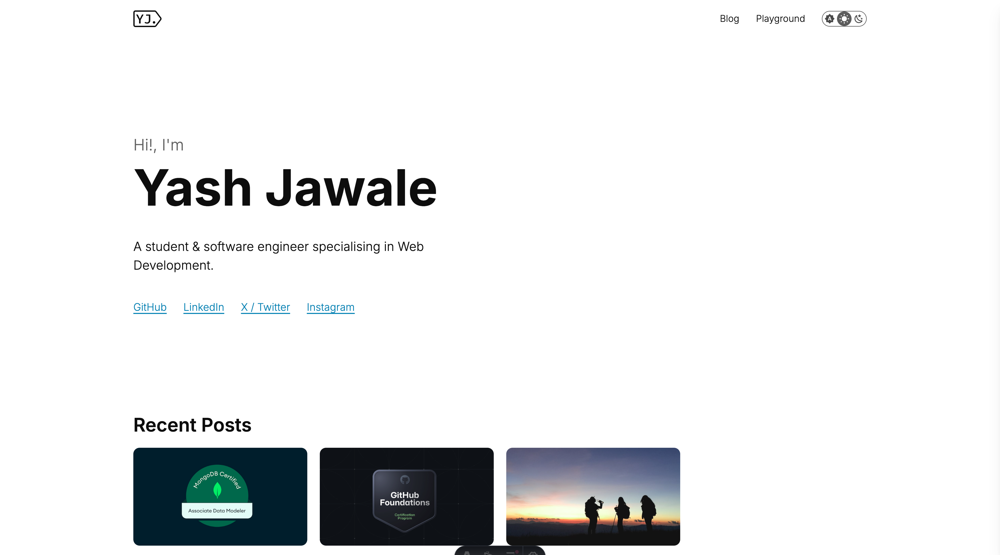

# Javier Jia's Personal Blog

A site for sharing my thoughts & experiments with the world!

Visit at [https://javierjia.github.io/](https://javierjia.github.io/)

## Features

- Image optimization on build
- Accessible emojis
- Automatic reading time display for posts
- Automatic last update status for posts
- Dark mode support
- RSS feed

## Running Locally

- Clone this repository
- Install dependencies with `npm i`
- Start dev server with `npm run dev`

## Adding a blog post

- Add `your-blog-post.md` file under `src/content/blog` (filename denotes the URL slug)
- Write content in file using Markdown syntax
- Add cover image at `src/assets/blogimages/<YOUR_SLUG>/cover.jpg` - Recommended dimensions: `853x480px`
- For adding images to content, use the folowing syntax for caption support ``
- Create a PR & merge after passing workflow checks
